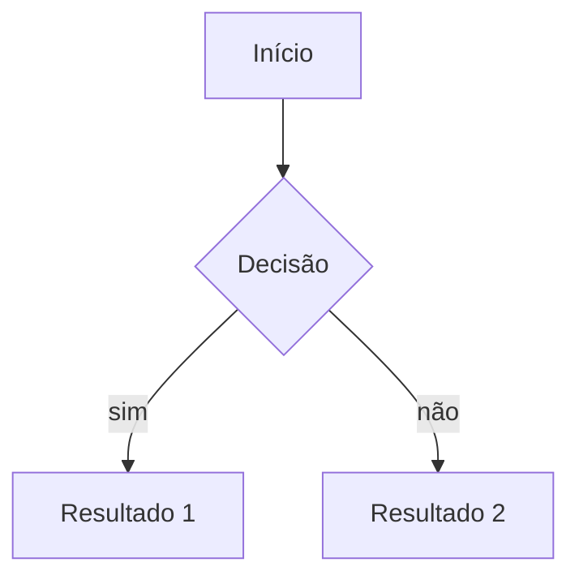

# Guia de sintaxe do Obsidian

Referência rápida de Markdown + recursos próprios do Obsidian. Consulte quando tiver dúvida
de como formatar algo numa nota.

## Texto básico

| Efeito | Sintaxe | Resultado |
|---|---|---|
| Negrito | `**texto**` | **texto** |
| Itálico | `*texto*` | *texto* |
| Negrito + itálico | `***texto***` | ***texto*** |
| Tachado | `~~texto~~` | ~~texto~~ |
| Realce (highlight) | `==texto==` | ==texto== |
| Código inline | `` `código` `` | `código` |

## Títulos

```
# Título 1
## Título 2
### Título 3
```
Até `######` (nível 6). Aparecem no painel de esboço (outline) da nota.

## Listas

```
- item
- item
  - subitem (2 espaços de indentação)

1. item numerado
2. item numerado

- [ ] tarefa pendente
- [x] tarefa concluída
```

## Links internos (o que diferencia o Obsidian)

```
[[nome-da-pagina]]              → link para outra nota pelo nome do arquivo
[[nome-da-pagina|texto exibido]] → mesmo link, com texto customizado
[[nome-da-pagina#Título]]        → link para um cabeçalho específico dentro da nota
[[nome-da-pagina#^bloco]]        → link para um bloco específico (ver abaixo)
![[nome-da-pagina]]              → embed: incorpora o conteúdo da nota inteira aqui
![[imagem.png]]                  → embed de imagem
![[nome-da-pagina#Título]]       → embed só de uma seção
```

**Nome do arquivo é a chave.** `[[link]]` resolve pelo nome do arquivo em todo o vault — por
isso nomes precisam ser únicos (invariante 6 do `CLAUDE.md`).

## Blocos e referência a bloco específico

Qualquer parágrafo pode virar um alvo de link se você marcar o fim dele com `^id`:

```
Esse é o parágrafo importante que quero referenciar depois. ^ideia-chave
```
Em outra nota: `[[pagina#^ideia-chave]]` linka direto para esse parágrafo, não para a nota
inteira.

## Links externos

```
[texto do link](https://exemplo.com)
```

## Citação (blockquote)

```
> Texto citado.
> Pode ter várias linhas.
```

## Callouts (caixas de destaque — recurso do Obsidian)

```
> [!note]
> Texto da nota.

> [!warning] Título customizado
> Texto do aviso.

> [!tip]- Título (o `-` deixa a caixa recolhida/colapsável por padrão)
> Conteúdo escondido até clicar.
```
Tipos comuns: `note`, `tip`, `warning`, `danger`, `success`, `question`, `quote`, `example`,
`bug`, `todo`, `abstract`, `info`. Cada tipo tem cor e ícone próprios no tema padrão.

## Tabelas

```
| Coluna A | Coluna B |
|---|---|
| valor 1  | valor 2  |
```
Alinhamento: `|:---|` (esquerda), `|:---:|` (centro), `|---:|` (direita).

## Linha horizontal

```
---
```
Separador visual. Cuidado: três traços sozinhos numa linha também fecham frontmatter se
estiverem no topo do arquivo — não confundir com o cabeçalho YAML.

## Frontmatter (propriedades da nota)

```yaml
---
tags: [economia, revisar]
status: em-desenvolvimento
data: 2026-08-18
---
```
Fica sempre na primeira linha do arquivo, entre `---`. Vira metadado pesquisável e filtrável
no Obsidian (aba de Propriedades, Bases, Dataview se instalado).

## Tags

```
#tag
#tag/subtag
```
Funcionam tanto no corpo do texto quanto no frontmatter (`tags: [x, y]`).

## Notas ao pé (footnotes)

```
Texto com uma referência[^1].

[^1]: Explicação da referência aqui embaixo.
```

## Comentário (não aparece na leitura renderizada)

```
%%Isso fica invisível no modo de leitura, só aparece no editor.%%
```

## Diagramas Mermaid

````

````
Renderiza como diagrama de fato dentro da nota — útil para processo, hierarquia, causa-efeito
(é o que o `CLAUDE.md` pede para explicações desse tipo dentro do TEACH).

## Bloco de código com linguagem

````
```python
print("oi")
```
````
A linguagem depois dos três acentos ativa o realce de sintaxe (syntax highlighting).

## Escapando caracteres especiais

Prefixe com `\` quando quiser que o símbolo apareça literal em vez de virar formatação:
`\*não vira itálico\*`, `\[\[não vira link\]\]`.
